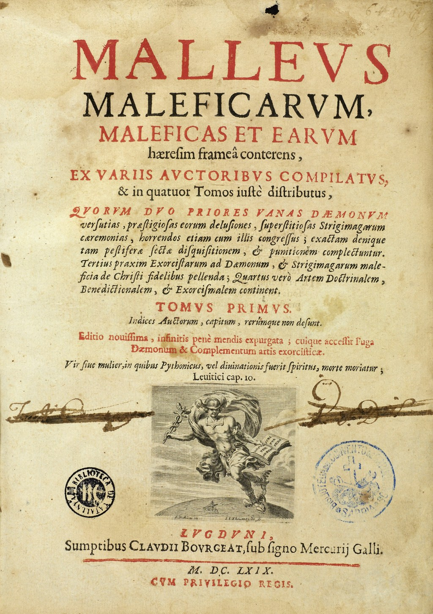

# 조현병의 이해 {#understanding-of-spr}

## 조현병 개념의 역사

### 고대

조현병 개념의 생성과 변천을 살펴보기 전에 앞서, 광증(insanity,
madness)이라는 개념을 먼저 살펴보아야 한다. 정신의학의 정통성에 의문을
제기하고, 반정신의학(anti-psychiatry)[^intro-1]의 기치를 내거는 소수
학자들은 조현병이 18,19세기 유럽 정신과 의사들이 만들어 낸 임의적 개념일
뿐이라고 주장한다. 또 다른 일부 학자들은 조현병이 서구 문명이 고도로
산업화되면서 발생하게 된, 일종의 문명병이라는 주장을 펴기도
한다.[(Torrey 1980)](https://paperpile.com/c/jNEHkh/Q6uG) 설령 조현병에
대한 이들의 주장에 어느 정도 일리가 있다 할지라도, 역사가 기록되기
시작한 이래, 어느 시대, 어느 문명에서도 광증에 대한 기록이 넘쳐난다는
것을 부인할 수 없다. 고대 이집트, 바빌로니아, 고대 중국 문명에서도
어렵지 않게 발견할 수 있으며, 구약성서에는 다윗을 의심하는 사울의
이야기가, 고대 그리이스 로마 신화에는 신들의 계략에 빠져 이성을 잃게
되는 인간들의 이야기가 적혀있다.[(Harris 2013; Torous and Keshavan
2014)](https://paperpile.com/c/jNEHkh/ZzVl+3q6y) 중세에는 마귀에
씌웠다는 명목으로 죽어간 무고한 희생자들의 기록이 광증 때문에
저주받아야만 했던 비참한 운명을 증거하고 있으며, 근세의 문학작품에도
수많은 망상과 환각의 기록들이 인류를 끊임없이 쫒아다니는 악령처럼
묘사되어 있다.

[^intro-1]: 광기를 정상의 반대로 간주하는 기존 정신의학을 비판하는 이론.
    반정신의학이라는 용어를 창시한 David Cooper에 따르면 정신병이란
    구체적 실체가 있는 존재가 아니며, 사회의 가치 기준이나 행동 규범에
    어긋나는 사람을 정상인들과 분리, 격리하기 위해 인위적으로 만들어진
    개념이다. 대표적인 학자로는 David Cooper외에 Ronald Laing, Thomas
    Szasz가 있다.

조상들이 광증을 어떻게 이해하려 애를 썼는지 알려면 상상력을 동원하는
수밖에 없다. 아마 그들도, 정상과 상식이라 규정되는 범위를 넘어서는,
기이한 말과 행동을 하는 사람들을 눈여겨 보지 않을 수 없었을 것이다. 불과
얼마 전까지만 해도 영민하고 용맹했던 사람이 갑자기 혼이 나간 것처럼
이상한 행동을 하거나, 아무런 대상도 없이 겁에 질려 전율하는 모습을 보면
분명 당황스러웠을 것이다. 고대인에게 모든 질병은 원인을 헤아릴 수 없는
신비로움의 현현이자 신의 변덕이었다. 하물며 실체가 보이지 않는 광증은,
경외감과 더불어 깊은 혐오감과 공포를 불러일으켰을 것이다.

역사 이전의 고대인들은 별의 움직임이나 기후의 변화뿐 아니라, 사람의 마음
속에 피어나고 소멸되는 갖가지 생각과 감정 역시 초자연적인 힘의 영향을
받는다고 믿었다. 자연히 광증은 초자연적 기운에 접했거나, 금기를 깨서
생기는 저주, 신이 내리는 징벌이라 여겨졌다. 이러한 고태적 생각으로부터,
광증이 뇌에 병이 들었기 때문에 생기며, 광증에도 종류가 있어서 각기
치료법이 다를 것이라는 생각으로 발전한 것은, 아무리 생각해도 너무나도
혁신적이고 과감하여, 도무지 어떤 계기로 얻어진 통찰인지 신비롭기만 하다.

### 그리스, 로마 시대 그리고 중세

광증을 초자연적 혹은 종교적 현상으로 해석하는 지배 이데올로기에 의문을
제기하고, 광증도 질병의 하나일 뿐이라는, 당시로서는 과감하다못해 위험해
보이는 주장을 내세운 것은 기원전 5-6세기 그리스에서 활동하였던
자연철학자들[^intro-2]이었다. 이들은 합리적 사고와 객관적 관찰을 통해
자연의 숨은 규칙성을 발견하고자 하였다. 그 대표적 인물인 피타고라스는
인간의 지성이 뇌에서 비롯된다고 주장하였으며, 비정상적 정념이나 행동은
마치 조율되지 않은 악기에서 불협화음이 생성되듯이, 불균형 상태에 있는
체액 때문에 생기는 것이라 제안하였다.

[^intro-2]: 자연철학자 (natural philosophers): 소크라테스 이전 고대
    그리스에서 활약하던 철학자들을 가리킨다. 이들은 수학적, 과학적
    그리고 철학적 연구의 기초가 되는 문제들과 역설들을 정의하는 데
    집중했으며, 전통적으로 행해지던 신화적 해석들을 거부하는 대신 좀 더
    이성적인 해석을 추구하였다. 대표적인 학파로는 밀레토스 학파,
    피타고라스 학파, 엘레아 학파가 있다.

자연철학의 발전은 바야흐로 의학의 혁신이라는 열매를 거둔다. 기원전
4세기에 활약하였던 히포크라테스[^intro-3]는 이론적 논쟁보다는 임상
관찰과 실제 치료 경험을 중요시하였다. 그는 피타고라스의 영향을 받아
지성과 감성이 뇌에서 비롯된다면, 광증이란 뇌기능의 이상에 다름아닐
것이라고 추론하였다. 당시의 치료는 체액의 균형을 바로잡는 데 초점이
맞추어져 있었기 때문에, 각각의 정신증상은 체액의 상대적 불균형에 따라
분류되었다.[^intro-4] 동시에 광증의 치료를 위해서 운동요법, 식습관 교정,
휴식, 목욕, 사혈 등을 통해 체액의 균형을 회복하는 방법들이 동원되었다.

[^intro-3]: Hippocrates (460\~370 BC): 고대 그리스 페리클레스 시대의
    의사로 의학의 아버지라 불리우기도 한다. 그와 그를 추종하는
    히포크라테스 학파는 마술과 철학에서 의학을 분리해내는데 혁혁한 공을
    세웠다.

[^intro-4]: 히포크라테스는 인간이 정액이나 자궁의 체액에서 탄생하고
    자라나는점을 근거로 이를 중요시했으며 따라서 액체가 생명의 근원일
    것으로 여겼다. 그는 혈액(blood), 담즙(bile), 점액(phlegm) 그리고
    물(water, 나중에 흑담즙(black bile)을 언급)의 4가지 체액으로 인간의
    병리를 설명하려하였다.

중세 이전 의학의 정점에 오른 인물은 로마에서 활약하였던
갈레노스[^intro-5]였다. 그 역시 광증은 뇌와 신경 계통의 이상 때문이라
여겼다. 그는 뇌 기능이 동물 영혼(animal spirit)[^intro-6]을 낳고, 동물
영혼은 신경계를 타고 흘러다니며, 이것이 말단 근육 운동을 일으킨다고
보았다. 여기서 만약 동물 영혼이라는 개념을 "전기화학적 신호"로 바꾼다면
지극히 현대적인 생각이 아닐 수 없다. 그는 만약 뇌가 독물, 체액, 열,
감정적 요인 등에 의해 영향을 받으면, 동물 영혼의 잘못된 움직임을 낳고
광증은 그 외적 표현이라고 생각하였다. 그 또한 철저한 실용주의자로서,
결론이 안 나는 병인론에 대한 철학적 분석보다는 있는 그대로의 현상을
관찰하는 것이 중요하다고 생각하였다. 증후군(syndrome), 질병특이적
증상(pathognomic symptom) 등의 개념은 그에게서 비롯되었다.

[^intro-5]: Claudius Galenus (129\~199 AD): 로마 제국 당시의 고대
    그리스의 의학자이자 철학자. 히포크라테스 이래 최고의 의사로 꼽힌다.
    생체 해부를 실시하였고, 특히 신경계에 관해서 많은 연구를 하였다.

[^intro-6]: 동물 영혼(spiritus animalis): 갈렌에 의해 창시된 이론.
    동물영혼은 마치 4체액과 비슷하게 비어있는 신경을 흘러다니면 신체
    기능을 조정한다고 믿어졌다. 이후 1500년 이상 신경기능을 설명하는
    주요 이론으로 자리잡았다.

이렇듯 그리스-로마 시대만 해도 벌써, 광증은 뇌의 이상때문이며, 질병
분류를 통해 각각의 질병에 효과적인 치료법을 찾을 수 있다는 현대적 개념이
정립되어 있었다. 그러나 기독교의 도입 이후 중세를 거치면서, 과거의
과학적 유산은 모두 파괴되었고, 광증은 악마의 소행이거나 신의 징벌이라는
개념으로 후퇴하였다. 동일한 광증이라도 기독교의 종교 논리에 어긋나면
이단으로 처단되었고, 교리에 부합하면 성인으로 추앙 받는 기묘한 시대가
바로 중세 유럽이었다.

그 중에서도 가장 참혹했던 사건은 14세기부터 18세기 까지 전 유럽을 혼란
속에 몰아넣었던 마녀 사냥이었다. 마녀 사냥은 백년 전쟁이 끝나고 정치적,
경제적 혼란과 개혁에 대한 염원이 높아지던 시기에 시작되었다. 오랜 전쟁
속에서 교회의 권위가 무너지기 시작했고, 화폐의 등장으로 말미암아 자본을
축적하게 되는 대상인들이 등장하면서 교회는 예수와 대립된 존재로서 악마와
마녀를 만들어냈다. 유럽 전역에서 50만명이 넘는 사람이 마녀 혹은
마법사라는 죄목으로 처형되었는데, 특이하게도 "마녀"라는 명칭에서 알 수
있듯이 그중 다수가 여성이었다.

1487년 하인리히 크레이머와 자콥 스프렝거라는 두 명의 도미니코 수도회
성직자는 "마녀의 망치(Malleus Maleficarum)"이라는 마녀사냥 지침서를
출간한다. 이 책은 마녀를 쉽게 구분하고 판결을 내릴 수 있는 기준을 나열한
책이다. 문제는 이 책의 저자들이, 악마의 술책은 인간 심리의 약점을
교묘하게 파고드는 것이라 믿었다는 점이다. 사회에서 소외되어 있는
사람들(특히 가난한 여성)의 말이나 행동, 혹은 신체적 증상이 당시의 의학적
지식으로 설명되지 않을 때, 종교재판관은 악마가 피해자의 영혼을
사로잡았기 때문이라고 설명하였다. 악마에게 영혼을 빼앗긴 것은 애초에
신앙심이 굳건하지 못했기 때문이요, 그 자체가 죄와 타락의 증거가 되었다.
이런 해석하에 광증을 비롯하여, 우울증, 히스테리아 등을 보이는 많은
환자들이, 편견에 치우친 증거와 고문으로 얻어진 자백하에
처형되었다.[^intro-7]

[^intro-7]: 물론 수많은 정신질환자들이 마녀 사냥으로 인해 처형되었다는
    분명한 증거는 존재하지 않는다. 당연하겠지만 정신질환자라고 진단을 한
    적이 없기 때문이다. 이후 역사가들이 이렇게 생각하는 이유는, 다양한
    마녀 판례집에 기술된 묘사가 다양한 정신병리와 놀랄만큼 유사하기
    때문이다. 정신질환자들이 광신적 종교관과 교회의 권력욕에 의해
    희생양이 되었다는 식의 관점은 정신분석가이자 의사학자인 Gregory
    Zilboorg로부터 비롯되었다. 그는 광증과 마법, 이단이 하나의 개념으로
    융합되고, 그것이 정신질환이라는 의학적 상태때문일 지 모른다는 합리적
    의심이 완전히 배제되는 바람에 이 모든 비극이 초래되었다고
    주장한다.[(Zilboorg and Henry
    1941)](https://paperpile.com/c/jNEHkh/3JaE)

{width="50%"}

이러한 비극은 그저 역사의 한 페이지로 넘겨버릴 수도 있었을 것이다.
그런데, 반정신의학을 주장하는 학자들은 이러한 비극이 현재도 끊임없이
재생 반복되고 있다고 주장한다. 사회복지학자인 Kutchins와 Kirk는 "우리는
미치게 하는 것: 정신의학의 성서인 DSM과 정신질환의 창조 (Making Us
Crazy: DSM, the Psychiatric Bible and the Creation of Mental
Disorders)"라는 책[(Kutchins and Kirk
1997)](https://paperpile.com/c/jNEHkh/xO8Y)에서 정상과 비정상의 경계를
규정하는 DSM이 어떻게 사람들간의 차이와 일상적 고통을 정치적, 경제적
목적을 위해 질병화하고 있는지를 비판한다. 혹자는 DSM이 현대의 "마녀의
망치"에 지나지 않는다는 가혹한 비판을 내리기도 한다.[(Melanson
)](https://paperpile.com/c/jNEHkh/xtIK)

### 근대

18세기 계몽주의의 태동을 기점으로 해서, 종교에 의해 이성(reason)이
폄하되는 시대는 막을 내리기 시작하였다. 이성[^intro-8]이 인간존재의
정수라고 여겨지는 것만큼, 광증은 "이성을 잃는 것"으로 이해되었다.
초기에는 광증을 굳이 분류할 필요성도 개념적 틀도 존재하지 않았다. 이러한
상황은 린네[^intro-9]가 식물의 체계적 분류를 시도하면서 바뀌게 되었다.
자연을 이해하고 정복하는 길은 나누고 분류하는 것부터 시작되어야 한다는
암묵적 합의가 이루어졌고, 질병 역시 예외가 아니었다. 이에 린네의
계통학적 분류에 기반을 둔 질병분류학[^intro-10]이 탄생되었다.

[^intro-8]: 18세기 유럽은 과학문명이 급속도로 발전하던 때였다. 뉴턴
    역학의 성공에 도취된 철학자들은 우주가 이성적이고 필연적인 법칙에
    의해 지배되며, 인간의 능력으로 이를 파악할 수 있다는 믿음을 갖게
    되었다. 그 전까지 종교적 세계관은 진리란 하나님으로부터 인간에게
    은총을 통해 부여되는 것이었다. 그러나 계몽주의 철학자들은 모든
    인간은 자연법칙을 이해할만한 이성을 갖고 태어나며, 외적 권위와
    지식을 무비판적으로 수용하는 것이 아니라, 이성을 도구로 하여 우주와
    인간 사회를 지배하는 이성적이고 필연적인 법칙을 스스로 파악해 나가야
    한다고 주장하였다. 개인이 이러한 책임을 수행하면 인간 사회 역시
    끊임없이 개혁되어 진보할 것이라는 낙관주의가 팽배하였다. 따라서
    개인의 이성은 기본 권리인 동시에 의무이기도 하다.

[^intro-9]: Carl Linnaeus (1707\~1778): 스웨덴의 식물/동물학자. 현대적
    생물분류학을 제창하였다.

[^intro-10]: 질병분류학(nosology): 질병을 구분하고, 그 계층적 관계를
    규명하는 학문. 보다 광범위한 분류학(taxonomy)의 한 부분이다. 린네의
    생물분류체계를 본따, 종의 개념에 상응하는 질병분류학적 단위를
    가정하고, 그 상위 범주와 하위 범주를 모색함으로써 전체 계층 질서
    내에서 개개 단위의 위치를 규정한다.

린네 분류법의 기초는 분류의 근거가 될 특징들을 선정하는 것이다. 린네
이전까지는 외적 특성뿐 아니라, 용도, 타 개체와의 유사성 등 자의적 기준에
따라 그때그때 분류가 이루어졌다. 이에 반해 린네는 최대한 객관적이고 관찰
및 확인이 가능한 특징들을 분류의 기준으로 선정하였다. 마찬가지로 질병
분류학에서도 객관적 기준들이 필요했고, 증상 및 징후, 추정되는 원인,
손상부위 등이 후보로 모색되었다. 이러한 지표들에 대한 지속적 관찰로
데이터가 축적되면서, 점차 정신과 의사들은 특정한 증상, 징후가 서로
연관되어 나타나는 패턴을 인식하기 시작하였다. 이에 따라 과거의
단일정신병(monolithic insanity) 개념은 점점 세분화되기 시작하였다.

린네가 도입한 또 다른 혁신적인 개념은 "종(species)" 개념이다. 린네에
따르면 "종"은 태초에 창조된 단위이고 불변하는 것으로서, 임의적인 분류
단위가 아니라 실제로 존재하는 것이다.[^intro-11] 마찬가지로 개개질환은
더 이상 나눌 수 없는 실재하는 단위로 여겨졌다.

[^intro-11]: 자연적 종(natural kind): 과학은 이해의 대상을 명백히 하기
    위해, 자연 현상을 끊임없이 분류해왔다. 이러한 분류는 인간의 필요에
    의해서, 현행 이론에 부합시키기 위해서, 지각하거나 측정하는 도구의
    한계때문에 임의적으로 행해지는 경우가 많다. 그러나 이와 달리,
    자연현상을 지배하는 규칙에 부합하는 분류가 있을 수 있고, 이러한
    분류를 통해 나뉘어진 단위를 자연적 종이라 한다. 예를 들어 화학적
    원소는 서로 다른 원자량으로 분명히 구분된다. 생물의 종은 유전자의
    유사성, 혹은 교배했을 때 생식가능한 자손을 얻을 수 있느냐로 분명히
    정의된다. 이들은 자연적 종의 대표적인 예이다.

질병의 분류에 린네적 접근을 최초로 적용한 사람은 de
Sauvages[^intro-12]이다. 그는 당시까지 알려진 모든 질환들을 10개의
과(classes), 295개의 속(genera), 그리고 24,000개가 넘는 질병단위로
구분하였다. 정신질환에 있어서 19세기 초까지 가장 영향력있고 인기있던
분류체계는 Cullen[^intro-13]이 제시한 분류였다. 정신질환은 신경병리의
반영이라 생각했던 그는 "신경계의 질환"이라는 뜻으로
"신경증(neurosis)"이라는 단어를 만들어냈다. 그는 신경증을 네 개의
속(genera)으로 분류하였는데, 그 중 판단력의 장애를 의미하는 vesania가
광증에 해당되었다. 이후 피넬[^intro-14], 에스퀴롤[^intro-15] 등 초기
정신의학자들이 Cullen의 분류체계를 보완하거나 수정함으로써
질병분류체계를 정교화하였다. 그러나 분류의 잣대도 변변히 마련되지
못하였고, 이론적 편견과 근거없는 유추에 의해 얻어진 병인을 분류의
기준으로 삼는 바람에 19세기의 질병분류학은 혼란 그 자체였다.

[^intro-12]: Francois Boissier de Sauvages (1706-1767): 프랑스의
    의사이자 식물학자. 린네의 친구로 질병분류를 최초로 시도하였따.

[^intro-13]: William Cullen (1710-1790) 스코틀랜드의 의사이자 화학자.
    에딘버러 의과대학의 교수로 의학 교육의 초석을 세웠으며, David Hume과
    Adam Smith의 친구로서 스코틀랜드 계몽주의의 중심인물이었다.

[^intro-14]: Philippe Pinel (1745\~1826): 프랑스의 정신과 의사로
    비세트르와 살페트리에 병원의 수석 의사로 일했다. 정신질환 환자들을
    족쇄에서 풀어주는 등, 당시에 만연헀던 비인도적 치료, 관리 행태를
    타파하고 도덕 치료(moral treatment)를 시도하였다. 이밖에도 사혈,
    관장 등 비효과적인 치료를 줄이고, 환자를 자세히 관찰하고 긴밀한
    대화를 나누는 방법을 사용하였다. 이는 심리치료라기보다는, 환자
    개개인의 독특한 병리현상을 최대한 수집하여, 정신질환에 대한 이해를
    강구하려는 노력이었다.

[^intro-15]: Jean-Étienne Dominique Esquirol (1772\~1840): 프랑스의
    정신과 의사. 피넬(Philippe Pinel)의 제자로 그를 이어 살페트리에
    병원의 수석 의사를 역임하였다. 정신과 환자들의 처우개선과 인도적
    치료를 위해 애썼으며, 정신병원이 단순한 수용소가 아니라 치료를
    행하는 장소가 되어야 함을 역설하였다

19세기 중반까지만 광증은 단일한 질환으로 여겨졌으며, 이러한 개념을
단일정신병[^intro-16]이라고 하였다. 이 이론에 따르면 인간의 육체와
영혼은 단일한 복합체를 이루며, 어떤 정신질환이라도 육체-영혼 복합체의
이상이라는 점에서 서로 다르지 않다고 여겨졌다. 그러나 복합체의 이상은
그것이 거치는 단계에 따라 다양한 양상을 보이게 되는데, 이렇게 서로 다른
양상들이 각기 다른 명칭으로 불리면서 질병분류는 혼란에서 벗어나지
못하였다. 정신증(psychosis)이라는 명칭은 1840년대 초 각각 독일과
오스트리아에서 활동하던 Canstatt와 Feuchtersleben에 의해
명명되었다.[(Beer 1996)](https://paperpile.com/c/jNEHkh/OC0r) 이 명칭은
본래 뚜렷한 뇌병변으로부터 비롯된, 즉 기질적 원인에 의한 정신병리를
지칭하기 위해 만들어졌으나, 개념의 경계가 모호하여 히스테리, 멜랑콜리아,
조증, 편집증 등 광범위한 상태를 포괄적으로 의미하곤 하였다.[(Bürgy 2008;
Torous and Keshavan 2014)](https://paperpile.com/c/jNEHkh/Z4v9+3q6y)
당시만 해도 신경증과 정신증의 구분도 명확하지 않았고, 뇌의 병과 마음의
병이라는 구분 역시 혼란스러웠다.

[^intro-16]: 단일정신병(unitary psychosis, Einheitspsychose): 크레펠린
    이전까지 독일 정신의학에서 통용되던 이론으로, 모든 종류의 정신증은
    단일 질환의 서로 다른 변형일 뿐으로, 개인의 특성이나 질병 단계에
    따라 표면적으로만 달리 나타나는 것이라 생각한다. 또한 신체, 마음,
    영혼을 구분하는 데카르트 주의에 반대하였기 때문에, 정신질환을 정신의
    병과 육신의 병으로 나누는 것도 반대하였다. 단일정신병 개념은
    크레펠린 이후 자취를 감추는 것처럼 보였으나, 1980년대 후반 이후
    Crow, Craddock, Owen 등에 의해 다시 부활하고 있다. Tim Crow는
    조현병과 양극성 장애의 증상이 분명히 구분되지 않으며, 취약 유전자가
    상당 부분 서로 겹치고, 가계 내에서 함께 유전되며, 조현정동 장애 역시
    두 질환과 증상, 유전자 측면에서 잘 구분되지 않는다는 것을 근거로
    특히 조현병과 양극성 장애를 "연속성 정신병(psychosis continuum)"으로
    이해할 것을 주장하였다.[(Crow 1986; Craddock and Owen
    2007)](https://paperpile.com/c/jNEHkh/sp7v+KVbw)

{width="50%"}

### 크레펠린 이전의 조현병

현재의 조현병은 그 기원을 크레펠린의 질병 분류에 두고 있다. 그는 다양한
정신증의 형태 중에서 어떤 특정한 패턴에 주목하였고, 이를 조발성
치매(dementia praecox)[^intro-17]라 칭하였다. 왜 갑자기 역사에서
조현병이 등장한 것일까? 광증은 예나 지금이나 있어왔지만, 조현병이라는
특별한 형태의 광증은 19세기에 새롭게 등장한 질병인 것일까? 아니면,
크레펠린이 이를 규범화하기 전까지는 누구의 눈에도 보이지 않았던 것일까?

[^intro-17]: 조발성 치매(Dementia praecox): 이 용어를 처음 사용한 것은
    1852년 프랑스의 의사인 Bénédict Augustin Morel에 의해서였다. 당시
    치매(dementia)라는 용어는 이미 인지기능의 비가역적 감퇴라는 의미로
    사용되고 있었는데, Morel이 어떤 기준으로 사용했는지는 분명하지 않다.
    현대의 정신증 환자에게 이 용어를 사용한 것은 헝가리의 정신과 의사인
    Arnold Pick이었다. 크레펠린은 당시까지 너무나 세분화되어있던
    정신증의 분류체계를 조울정신병(manic-depressive psychosis)과 조발성
    치매(dementia praecox)로 단순화하기 위해 이 명칭을 빌려왔고, 그 덕에
    마치 이 이름을 처음 사용한 사람처럼 알려져 있다. 블로일러는 치매라는
    명칭이 주는 부정적 인상을 지우기 위해
    정신분열병(schizophrenia)이라는 명칭을 제안하였고, 이는 각각의
    정신기능이 통합하여 기능하지 못한다는 정신분석적 이론에 근거하고
    있다. 그가 쓴 저서의 제목은 "Dementia praecox or the Group of
    Schizophrenia"라 하여 예후가 다양한 이질적인 상태들을 모두
    정신분열병이라는 범주에 집어넣고자 하였다. 그러나 Kurt Schneider가
    진단특이도를 높이기 위해 일급증상(first-rank symptoms)이라는 개념을
    도입함으로써 정신분열병의 범주는 다시 좁아졌고, 평생 회복하기 어려운
    난치병이라는 인상으로 굳어졌다.[(Gaebel & Kerst,
    2019)](https://paperpile.com/c/j3mtWJ/mtNQ4)

정통 정신의학은 후자의 견해를 받아들인다. 조현병은 예로부터 "실제로"
존재하고 있었지만, 객관적, 실용적 관찰이 정교해 지면서 그 실체가
드러나게 된 것으로 여겨진다. 그러나 한편으로는 크레펠린이 조현병을
구분한 것은 오로지 편의상 현상을 기술한 것에 지나지 않으며, 당시의
문화적, 사상적 배경에 의해 취사 선택된 것일 뿐이라는 주장도 만만치 않다.
그럼에도 분명한 것은 19세기 초에 이르러서야, 지금 우리가 조현병으로
진단할 수 있는 임상증례에 대한 기록이 처음 나타났고, 19세기를 통과하면서
그 양이 폭발적으로 증가하였다는 것이다. 혈기왕성한 젊은이가 아무런
이유도 없이 끝도 없는 악화를 거쳐 인간성을 상실하는 지경에 이르게 된다는
극적인 반전과 비극성은 많은 정신과 의사들의 마음을 사로잡았다. 현재의
진단기준으로 조현병으로 진단되는 최초의 임상기록은 19세기 초 프랑스와
영국에서 거의 동시에 보고되었다. 프랑스 살페트리에 병원의 피넬과 영국
베들렘 병원의 하슬람[^intro-18]은 서로 안면도 없는 사이였지만, 1809년 두
사람은 각각 전형적인 조현병 환자 증례를 발표한다. 그들이 발표한 사례는
"피넬-하슬람 증후군"이라 불리기도 하는데, 점진적인 발병, 두드러진
음성증상, 무정동, 사람에 대한 관심의 소실 그리고 점차적인 인지기능
저하를 특징으로 하고 있으며, 모두 청소년기에서 청년기로 넘어가는 나이에
발병하기 시작한 경우였다.

[^intro-18]: John Haslam (1764--1844): 영국의 약사이자 의사. 원래 베들렘
    병원의 약사로 경력을 쌓았으며, 쉰살이 넘어서야의사 자격증을
    취득하였다. 편집성 조현병 환자에 대한 최초의 임상 기록을 남겼다.

피넬-하슬람 증후군의 핵심은 젊은 나이에 발병해서 빠른 기간 내에 현저한
기능상실을 가져온다는 데 있었다. 물론 Cullen의 분류를 비롯한 당시의
진단분류적 접근은 철저히 횡단적인 증상과 징후의 특색에 기반을 두고
있었지만, 피넬과 하슬람의 천재성은 질병의 경과와 최종결과라는 종적인
변화양상을 특색으로 끄집어 낼 수 있었다는데 있다. 한번 학자들의 주목을
받기 시작하자, 유사한 증례에 대한 보고는 급증하게 되었다. 더군다나
광증에 대한 정신과 의사들의 견해를 결정지은 데는, 수용소(asylum)라는
독특한 제도의 영향 역시 간과할 수 없다. 신으로부터 버림받은 광증
환자들을 돌보아주던 수도원이, 공식적으로 런던 시에 의해 왕립 베들렘
병원[^intro-19]으로 거듭난 것은 1547년의 일이었지만, 17세기 이후에는
유럽 각국의 지방 중소도시에 다양한 규모의 정신질환자 수용소(asylum)를
쉽게 찾아볼 수 있게 되었다. 미셀 푸코[^intro-20]가 지적했듯이, 이성의
힘이 강조되던 계몽주의 이데올로기 하에서, 이성이 소실된 결과를 극명하게
드러내 주는 광인들은 정상인으로부터 격리되어, 관찰의 대상이 되어야만
하였다. 한번 수용소에 입원된 환자들은 퇴원하는 일이 거의 없었다. 이
때문에 출범 초기에는 비교적 안락하고 쾌적한 요양시설로 시작했던
시설들마저, 점차 회복에 대한 희망도 없이 사회로부터 격리된 환자들을
과밀하게 수용하는 비참한 장소로 변모해갔다. 조현병이 19세기에 생겨난
문명병이라고 주장하는 학자들은 수용소가 이렇게 단시간에 과밀화된 현상을
그 증거로 지목한다. 18세기만 해도 수용시설을 채우는 환자들은 주로 알코올
중독과 매독 환자들이었기 때문이다. 그러나 19세기 후반 수용시설을 꽉 채운
환자들은 금단 섬망에 시달리는 알코올중독자와는 달리, 전혀 회복의
가능성을 보이지 않았다. 1878년 23살의 앳된 나이에 뮌헨 시립 수용소에
발령받은 크레펠린 역시 병동을 꽉 채운 광증 환자들에게 혐오감과 절망감을
느끼지 않을 수 없었다. 대형 수용소에서 일했던 정신과 의사들은 풍부한
임상 자료에 접할 수 있었고, 이론적 틀이 없었다 할 지라도 관찰과
분류만으로도 상당한 통찰에 도달할 수 있었다. 이 시기에 에스퀴롤은 환각에
대하여 "감각자극을 일으킬만한 외부 대상이 없는데도, 분명히 감각을
경험했다면 확신하는 현상"이라고 정의하였다. 그는 환각은 정신증의
증상임에도 불구하고, 많은 의사들이 말초 감각기관의 이상으로 착각한다고
짚어내었다.[(Telles-Correia et al.
2015)](https://paperpile.com/c/jNEHkh/u2JN) 거의 비슷한 시기에
Kahlbaum[^intro-21]은 편집증과 긴장증(catatonia)에 대해,
Hecker[^intro-22]는 파과증(hebephrenia)에 대해 각각 기술하여, 정신증의
개개 증상에 대한 이해의 발판을 마련하였다.

[^intro-19]: Bethlhem Royal Hospital: 원래는 1247년 런던의 베들렘이라는
    지역에 세워진 소규모 성모 수도원이었다. 일찍부터 빈민 구호와 병자
    치료를 해왔기 때문에 점차 병원으로 발전하게 되었다. 정신질환자를
    언제부터 받기 시작했는지는 분명하지 않으나, 아마도 1377년 무렵부터
    시작되었던 것으로 전해지는데 1460년 경에는 이미 실질적으로
    정신질환자 전용 병원으로 탈바꿈해있었다. 1666년 런던 대화재때 건물이
    소실되었으나, 정신질환자 수용시설의 필요성이 다급하여 1676년에
    규모를 확장하여 재건되었다. 적당한 치료법이 없었기 때문에
    수용자들에게 수갑과 구속복을 입혀 관리하곤 하였고, 18세기 중반부터는
    일반인에게 돈을 받고 환자들의 일상을 공개하기도 하였다. 이는 관광
    목적이외에, 도적적 타락의 말로에 대한 경계심을 일깨우려는 교육적인
    목적이 있었다. 워낙 악명이 높아 "bedlam"이란 단어가 혼동, 광기의
    뜻으로 사용되기도 하였다.

[^intro-20]: Michel Foucault (1925\~1984): 프랑스의 철학자.
    후기구조주의, 포스트모더니즘 철학의 대표적인 기수로 여겨진다.
    근본적인 철학은 권력집단이 지식에 대한 독점권을 통해 피지배 계급을
    억압한다는 것이다. 1960년 출간한 "광기와 문명(Madness and
    Civilization)"이라는 저서를 통해, 광기란 구체적 질병이 아니라,
    자신들과 다른 이방인을 억압, 축출하기 위해 고안한 사회적 계약에
    지나지 않는다고 주장한다.

[^intro-21]: Karl Ludwig Kahlbaum (1828\~1899): 독일의 정신과 의사.
    괴를리츠 정신병원 소장을 역임하였다. 직장 동료이자 제자인 Ewald
    Hecker와 함께 젊은 정신증 환자들을 분류하고자 하였고, 그 과정에서
    현재까지도 사용하고 있는 dysthymia, cyclothymia, catatonia,
    paraphrenia, hebephrenia 등의 개념을 정립하였다. 긴장증에 대한
    연구를 통해, 긴장증은 운동기능의 이상으로, 조증, 우울증, 정신증에서
    나타나는 진행성 질환으로 결국에는 치매에 이른다고 하였다.

[^intro-22]: Ewald Hecker (1843\~1909): 독일의 정신과 의사로 Kahlbaum의
    제자. Kahlbaum과 함께 만들어낸 많은 개념중 파과증(hebephrenia)과
    순환성 기질(cyclothymia)는 Hecker에 의해 정립되었다. 이러한 다양한
    증상들을 통해 당시의 단일정신병 개념에 반대하여 정신증에도 다양한
    질병이 있을 수 있음을 주장하였다.

당시의 정신질환, 특히 조현병을 이해하는 가장 중요한 개념적 축은
퇴행/변성[^intro-23]이라는 개념이었다. 일반적 광증에 비해 조현병이 갖는
두드러진 특색은 어린 나이에 시작되는 점진적이고 궁극적인 변성에 있었다.
원래 변성이란 생물학적 종의 다양성을 설명하기 위한 개념으로 동물학자였던
Buffon[^intro-24]에 의해 도입되었다. 그는 창조된 원형 상태의 종이 시대가
바뀌고 환경이 다양해짐에 따라 점차 변성되면서 현재의 다양한 종으로
변모했다고 믿었다. 이는 현실은 이데아의 불완전한 모사에 지나지 않는다는
플라톤 철학의 반영이기도 하였다. Buffon의 이론을 추종했던 프랑스의
정신과 의사 Morel[^intro-25]은 합리적이고 고귀한 인간이라는 종이
에덴동산 시절 이후 신체적, 지적, 도덕적으로 타락해왔다는 의미에서,
정신질환을 변성의 결과로 이해하였다. 그가 이성의 힘을 잃고 의식이
혼미해져 가는 일군의 젊은 환자들에게 "démence precocé"라는 이름을 사용한
것도 같은 맥락에서였다. 이 개념은 당시 사회적, 정치적, 의학적 상황에서도
시의 적절한 것이었다. 갑작스러운 산업화로 인한 도시의 슬럼화와
알코올중독 및 매독의 창궐, 범죄의 급증, 흑인과 인디언에 대한 차별과
압박을 정당화해야 할 필요가 있었고, 무엇보다 정신질환자의 급증은
인간이라는 종 자체가 변성되고 있는 증거라고 받아들여졌다. Morel 역시
인간이라는 종의 변성 현상을 역설하며, 타락에 빠져드는 세기말 유럽에
경종을 울린다. 선대의 도덕적 타락에 의해 변성의 씨앗이 뿌려지면, 유전
현상에 의해 대대로 가속화되며, 그 종착역은 결국 후손의 치매(demencé)라는
것이 그의 주장이었다.

[^intro-23]: 퇴행/변성(degeneration): Morel에 따르면 한 가계에서 질병이
    시작되면 대를 거듭할 수록, 인간의 원형(primitive type)에서 신체적 ,
    정신적, 지적, 도덕적으로 타락하게 되고, 결국 후손을 남기지
    못함으로써 종결된다. 변성은 6단계로 이어지는데, 5단계가 유전적
    광증이요, 최종 단계가 치매라고 여겨졌다.[(박종석 & 강웅구,
    2015)](https://paperpile.com/c/j3mtWJ/8SY6)

[^intro-24]: Georges-Louis Leclerc, Comte de Buffon (1707\~1788):
    프랑스의 자연철학자, 수학자. 모든 종은 하나님이 창조하신 단일한
    종에서 비롯되었다고 여겼기 때문에, 진화론자인 라마르크, 다윈 등에 큰
    영향을 미쳤다.

[^intro-25]: Bénédict Morel (1809\~1873): 오스트리아 출신의 프랑스
    정신과 의사. 변성 학설을 주장하였고, 혼미(stupor) 증상을 보이는
    환자들을 기술하기 위해 조기치매(dementia praecox)라는 용어를
    처음으로 사용하였다. 그는 단순히 환자들을 묘사한 것 뿐으로,
    조현병이라는 질병을 구분해내고 개념을 정립한 것은 이후 Pick과
    크레펠린의 공헌이다.

따라서 조현병의 초기 명칭에 "demencé"가 붙게 된 것은 자연스런
현상이었다. 이러한 개념적 편견은 다윈[^intro-26]의 진화론이 발표된
이후에도 전혀 나아지지 않았다. 다만 변성의 원인이 자연선택에서의 낙오로
바뀌었을 뿐이었다. 변성의 개념은 정신질환뿐 아니라 독일의
Krafft-Ebing[^intro-27]에 의해 변태성욕에, 이탈리아의
Lombroso[^intro-28]에 의해 범죄자에게, 그리고 미국에서는 신경쇠약
환자에게 확대되어 적용되었다. 이들은 모두 변성과정에 있는 가계에
등장하며, 해당 가계가 오염되었다는 증거로 여겨졌다.

[^intro-26]: Charles Darwin (1809-1882): 영국의 생물학자로 진화론을 주장

[^intro-27]: Richard von Krafft-Ebing (1840\~1902): 독일 정신과 의사.
    일탈된 성적 행위와 그 법의학적 해석에 대한 연구를 남겼다. 그는
    1886년에 이 분야의 기념비적 저작인 "성적 정신병리(\_Psychopathia
    Sexualis)"\_를 출간하였다. 새디스트, 마조키스트, 동성애, 페티시 등의
    영어 단어들은 모두 이 책에서 비롯된 것이다.

[^intro-28]: Cesare Lombroso (1835\~1909): 이탈리아의 범죄학자이자 의사.
    인간 본성에 범죄의 기질이 있기 때문에 모든 사람이 범죄자가 될 수
    있다는 기존 믿음에 반대하여, 범죄 성향은 유전되며 생리적 특질을 통해
    이러한 타고난 범죄자를 식별해낼 수 있다고 주장하였다.그는
    범죄자에게서 발견되는 미세 기형(minor physical anomaly)은 인간이
    진화의 궤적을 거꾸로 밟아 야만인으로 되돌아가는 증거라고 여겼고,
    이러한 야만성이 범죄자를 만들어낸다고 하였다. 이는 조현병 환자에게
    미세 기형이 자주 관찰된다는 현대적 이론과 맞닿아 있다.

### 크레펠린과 조발성 치매

크레펠린[^intro-29]은 Wilhelm Wundt[^intro-30] 밑에서 심리학자가 되고
싶어했던 영민한 청년이었다. 가난했던 그는 돈이 필요했기 때문에
청년시절부터 수용소에서 일했지만, 항상 그곳을 탈출하고 싶어했다고
전해진다. 그러나 역시 결혼자금을 마련하기 위해 써야만 했던 정신의학
교과서[^intro-31]가 크게 성공하면서 일찌감치 학계에 두각을 나타낸다.
그럼에도 불구하고 1891년 하이델베르그 대학 정신과의 교수이자, 부속병원의
원장으로 임명되고 나서야, 자신의 소명에 대해 수용하게 되었다고 전해진다.

[^intro-29]: Emil Wilhelm Georg Magnus Kraepelin (1856\~1926): 독일의
    정신과 의사. 그의 상세한 환자 기록과 이를 분석하여 패턴을 도출해낸
    방식 들은 근대 임상 연구 및 역학 연구의 토대가 되었다.

[^intro-30]: Wilhelm Maximilian Wundt (1832\~1920): 독일의 심리학자 겸
    철학자, 생리학자이며 "근대 실험 심리학의 아버지"라고 일컬어지고
    있다. 이전의 심리학이 철학적 사변에서 벗어나지 못하고 있을 때,
    분트의 실험실에서는 객관화된 수치, 다시 말해 측정이 가능한 형태로
    조작된 정의와 정확한 통계를 통한 과학적 연구가 진행되었다

[^intro-31]: "*Ein Lehrbuch der Psychiatrie* (*A Textbook: Foundations
    of Psychiatry and Neuroscience*)"은 크레펠린이 32세인 1883년에 처음
    출간되었으며, 크레펠린은 죽기 직전까지 이 책을 수정 보완하여 사망
    다음 해인 1927년 9판이 마지막으로 발간되었다. 그는 이 책에서
    정신의학은 일반 의학의 한 분야로, 다른 자연과학과 같이 관찰과 실험을
    통해 발전할 수 있음을 강조하였다.

당시 독일과 프랑스의 정신과 의사들은 자신들이 보고한 증례의 고유성을
강조하기 위해 하루가 멀다하고 새로운 용어들을 만들어내고 있었다.
크레펠린이 이 많은 용어들을 하나로 통합하는 체계를 구축하고자 했을 때,
그가 발견한 것은 다름 아닌 점진적이고 비가역적인
변성(degeneration)이었다. 그리징거[^intro-32]의 영향을 받은 그와 그의
동료들은 외적으로 드러나는 변성의 기저에는 역시 신경병리학적 병변이
깔려있다고 생각하였다. 1822년 Bayle[^intro-33]은 신경매독 환자의 뇌에서
거미막 염증(arachnitis)을 발견하였는데, 이는 최초로 광증의 원인이
뇌병변이라는 확고한 증거였다. 크레펠린의 동료인 알츠하이머[^intro-34]
역시 사후 뇌조직을 관찰함으로써 치매의 병변을 찾아내고자 하였고, 혁혁한
성과를 거두었다. 하지만 크레펠린은 뇌병변을 통해 질병을 분류하는 것은
무의미하다고 생각하였다. 그는 동일한 뇌병변도 서로 다른 증상을 일으킬 수
있으며, 서로 다른 뇌병변이 유사한 증상을 일으킬 수도 있다고 생각하였다.
크레펠린은 대신에 하슬람의 아이디어를 물려받아 발전시킨 Kahlbaum과
Hecker의 시도를 염두에 두고 있었다.

[^intro-32]: Wilhelm Griesinger (1817\~1868): 독일의 신경학자이자 정신과
    의사. 정신질환은 분명한 신경과 뇌질환이라는 점을 역설하여,
    생물정신의학의 아버지라 일컬어진다. 그 자신이 연구자였다기 보다는
    대학 연구실에 묻힐 수도 있던 이론들을 실제 임상에 적응하는데
    앞장섰고, 수용소가 아니라 대학부속병원에서 정신과 환자를 보는 모델을
    만들었다.

[^intro-33]: Antoine Laurent Jesse Bayle (1799\~1858): 프랑스의 의사로
    신경매독에 의한 진행 마비와 동반된 광증을 연구하였으며, 당시에는 이
    질환을 \_"maladie de Bayle"\_이라고 부르기도 하였다.

[^intro-34]: Alois Alzheimer (1864\~1915): 독일의 정신과 의사이자
    신경병리학자. 조발성 치매와는 다른 질환인 "조기 치매(presenile
    dementia)"를 기술하였다. 이 병을 알츠하이머 치매로 이름 붙인 사람은
    다름 아닌 크레펠린이다.

당시 유행하던 질병관은 Neumann[^intro-35]이 주장한 단일정신병(unitary
psychosis) 개념이었다. 광증은 다양한 외적 양상을 보이며, 동일한 환자라도
시간에 따라 나타나는 증상과 징후가 변하기도 한다. 또한 정상과 광증의
차이라는 것도 정도 차이에 불과하며, 정상인도 경우에 따라 광증의 증상을
나타낼 수 있다. Neumann의 이론은 한마디로, 모든 정신증상은 정상의
극단적인 양태라는 것으로, 현재의 차원적 접근과 맥이 닿고 있다. 그러나
Kahlbaum은 이에 질문을 던진다. 만약 횡단면적인 증상 및 징후가
변화무쌍하더라도, 병의 경과나 예후를 고려하면 불변하는 특색이 발견되지는
않을까? Kahlbaum은 학위논문에서 이러한 생각을 전개했고, 1871년 후배였던
Hecker와 함께 "파과증(hebephrenia)"이라는 병명을 붙인 일련의 증례를
발표한다. 그가 사례들을 통해 증명하고자 한 것은, 질병 분류의 기준에
종단적인 병의 경과를 추가한다면 좀더 합리적으로 질병 실체를 찾아낼 수
있으리라는 것이었다. Kahlbaum과 Hecker는 이외에도 긴장증(catatonia),
편집증(paranoia) 개념을 정리하였다. 이제 크레펠린이 이들을 어떻게
질병명으로 묶어내는지 기다리는 일만 남았다.

[^intro-35]: Heinrich Neumann (1814\~1888): 독일의 정신과 의사. 그는
    정신질환을 분류하는 것은 의미없는 자의적 해석일 뿐이라고 하였다.
    모든 정신질환은 광증단계로 시작하여, 혼동단계를 거쳐 궁극적으로는
    치매단계에 이른다. 그는 이러한 진행과정을 "변용(metamorphosis)"라고
    불렀다. 대학과 달리 정신병원이나 수용소에 근무하는 의사들은
    단일정신병 개념을 옹호했는데, 그들은 정확한 진단을 내릴 필요가
    없었을 뿐더러, 한 환자를 수십년간 관찰해보니 결국 Neumann의 관점이
    옳았다고 보았기 때문이다.

크레펠린 이전까지만 해도 대부분의 학술논문은 증례보고의 형식을 띠고
있었다. 저자는 철학적 논지를 통해 이론적 근거를 제시하고, 이를
뒷받침하는 증례를 분석과 함께 나열하는 형식이었다. 따라서 객관적 증거로
뒷받침되는 반박할 수 없는 논지란 있을 수 없었다. 크레펠린은 이러한 식의
연구는 객관적이지 못하다고 생각하였다. 연구자 자신의 이론적 편향에
휘둘리지 않는 좀더 객관적이고 중립적인 연구방법이 있으리라 고민하였다.

크레펠린이 근무하였던 하이델베르크 정신질환 수용소는 몰려드는 환자에도
불구하고 한번 입원한 환자는 퇴원시키기 어렵다는 현실때문에 골치를
썩혔다. 자연히 회복가능한 자와 회복불가능한 자를 조속히 구분하여
타병원으로 전원시키는 것이 큰 행정업무가 되었다. 효율적 행정처리를 위해
크레펠린은 "진단카드(Zähnkarten)"를 만들도록 하였다. 하이델베르크
수용소와 인근 수용소를 전전하게 되는 환자들은 누구나, 처음 입원시의
진단과 이후 변화된 진단, 그리고 그렇게 진단한 근거등을 기록한 진단카드를
소지하고 있었다. 따라서 진단카드만 보면, 그 환자의 수십년간에 걸친
진단과 증상의 변화를 일목요연하게 볼 수 있었다. 크레펠린은 수천장에
이르는 이 카드를 침대에 늘어놓고 이렇게도 묶어보고 저렇게도 묶어보곤
했다고 전해진다. 그러던 중 Kahlbaum이 기술했던 증상을 보이는 환자들이
종적으로 유사한 경과를 보인다는 것을 확신하게 된다. 그는 정신질환
역학연구(epidemiological research)의 선구자였던 셈이다.

크레펠린은 Kahlbaum이 기술한 파과증, 강직증, 편집증 개념을 모두 흡수한
조발성 치매라는 병명을 확고히한다. 그는 횡단면적 관찰만으로는
질병특이적(pathognomic) 증상이나 징후를 발견할 수 없으며, 오로지 종단적
경과 상의 특징을 함께 고려해야만 질병단위를 확인할 수 있다고 하였다.
그가 정신질환을 뇌병변에 따라 분류하고자 한 그리싱거의 염원에 거스른
것은, 원인이 되는 뇌병변을 찾기에는 당시의 학문수준이 따라오지 못한다는
반성이 있었기 때문이다. 이러한 철학은 1980년대 소위 신크레펠린 주의를
주창하는 미국 정신과 의사들이 DSM(Diagnostic and Statistical Manual of
Mental Disorders)을 만들게 된 이론적 근거가 되었다.

크레펠린은 5판 교과서부터 정신질환을 모두 13개의 큰 범주[^intro-36]로
나누었으나, 학계의 주목을 받은 것은 조발성 치매(dementia praecox)와
조울정신병(manic-depressive insanity) 둘 뿐이었다. 조울정신병 개념은
살페트리에 병원의 정신과 의사였던 Falret[^intro-37]와
Baillarger[^intro-38]에게로 거슬러 올라간다. 크레펠린은 단극성 장애와
양극성 장애의 구분없이 모든 정서적 요소를 갖는 광증은 단일한 질환이라
보았고, 이는 조발성 치매에 비해 훨씬 양호한 경과를 보인다고 주장하였다.
크레펠린의 주장은 학자들 사이에 상당한 반향을 불러일으켰다. 단순하면서도
우아하고, 더군다나 탄탄한 임상자료를 통해 얻어진 그의 분류는 빠른
시간안에 전유럽으로 확산되었다. 그러나 한편으로 조발성 치매 진단을
내린다는 것은 너무나 가혹한 것이 되어버렸다. 유서 깊은 가문들은 자기
혈통 중에 환자가 발생하면 이를 비밀에 붙이느라 바빴고, 신경쇠약 혹은
신경증(neurosis)이라는 진단이 대신 붙여졌다. 뇌의 병변이라는 의미에서의
neurosis가, 광증은 아니라는 의미의 neurosis로 의미가 전환된 것도 이러한
사회적 요구때문이었다.

[^intro-36]: Kraepelin's 1899 Classification I Infectious insanity II
    Exhaustion insanity III Intoxications IV Thyrogenous insanity V
    Dementia praecox VI Dementia paralytica VII Insanity with cerebral
    disease VIII Involutional insanity IX Manic-depressive insanity X
    Paranoia XI General neuroses XII Psychopathic states (degenerative
    insanity) XIII Defective mental development

[^intro-37]: Jean-Pierre Falret (1794\~1870): 프랑스의 정신과 의사.
    순환정신병(folie circulaire)의 개념을 창안했다.

[^intro-38]: Jules Baillarger (1809\~1890): 프랑스의 정신과 의사.
    Falret와는 독립적으로 조울병 환자 증례를 보고하였으나, Farlet의
    발표가 좀더 앞선다. Baillarger는 오히려 대뇌피질이 6개의 세포층으로
    구설되어 있음을 발견한 것으로 유명하며, 6개 세포층 중 신경섬유로만
    구성된 층을 bands of Baillarger라고 부른다.

그러나 모든 조발성 치매 환자가 회복을 하지 못했던 것은 아니었다.
크레펠린이 수집한 사례에서도 1/4에 해당되는 환자는 어느 정도 회복을
하였으며, 그가 완성하지 못했던 9판 교과서 원고에는 궁극적으로 회복하여
정상 생활을 하는 증례도 소개되어 있다. 크레펠린은 자신의 교과서를 여러
차례 개정하면서, 동료 의사들의 비판을 수용하여 질병의 개념과 이름을
변화시켰다. 말년에 나온 8판 교과서는 블로일러의 조현병 개념을
받아들였으며, 역시 블로일러가 제안한 단순 정신병(simple type) 개념도
추가하였다. 조발성 치매의 개념은 20년 이상에 걸쳐 수정, 보완되면서,
처음의 엄격하고 제한적인 개념에서 경계가 불분명하고 포괄적인 개념으로
변모하게 된다. 그러다보니 크레펠린의 교과서 8판에는 무려 10개의 아형이
기술되었고, 또 다시 이질적인 진단의 집합체가 되어버렸다.

### 블로일러와 조현병

한편 조발성 치매가 회복 불가능하다는 견해를 비판한 대표적인 연구자 중 한
사람이 블로일러[^intro-39]였다. 당시에는 이미 프로이트, 융의
정신분석학이 큰 파장을 불러일으키고 있었으며, 특히 융과 함께 수학했던
블로일러는 광증에도 심리적 의미가 있을 것이라는 생각과 함께, 개인
내부에서 다양한 정신기능을 하나로 아우르는 통합적 기능이 있을 것이라는
생각을 도입한다. 블로일러는 이러한 고차원적 통합뿐 아니라, 연상 과정의
통합 역시 조현병을 이해하는데 적용시켰다. 연상 이론이란
밀[^intro-40]이나 하틀리[^intro-41]와 같은 영국 철학자들에게로 거슬러
올라가는데, 블로일러는 조현병 환자의 주된 병리적 특징이 이러한 연상
과정의 와해에 있다고 주장하였다.

[^intro-39]: Eugen Bleuler ()

[^intro-40]: John Stuart Mill ()

[^intro-41]: David Hartley (1705\~1757)

광증이 정신기능의 파편화와 통합의 상실에 있다는 개념은 그 뿌리를 오랜
서양전통사상 속에 두고 있다. 칸트에 따르면 인간은 육체와 정신이라는
근본적 균열 이외에도, 자유의지와 결정론, 실제(noumenal)와
현상(phenomenal)이라는 근원적인 균열 속에서 기적적인 통합을 이루고 있는
존재이다. 과학적 맥락에서 인간의 이중성이 논의된 것은 1844년으로 거슬러
올라간다. 영국의 의사였던 Arthur Wigan[^intro-42]은 인간의 좌우 뇌에는
각각 서로 상충하는 의지가 자리잡고 있다고 주장하였다.[(Clarke
1987)](https://paperpile.com/c/jNEHkh/TlqJ) 뒤이어 Wernicke[^intro-43]는
고위정신기능과 하위정신기능을 구분하였고, 이는 다윈의 진화론의 영향력을
등에 업고 현재까지도 널리 받아들여지고 있다. 19세기 말 히스테리와
최면요법의 등장으로 말미암아 무의식의 존재가 가정되었고,
Janet[^intro-44]는 정신을 통합하는 기능의 약화로 말미암은 해리 현상을
제안하였다.

[^intro-42]: Arthur Ladbroke Wigan (1785\~1847): 영국의 의사이자 작가.
    1844년 "마음의 이중성(The Duality of Mind"이라는 책을 펴냈다.

[^intro-43]: Carl Wernicke (1848\~1905): 독일의 정신과 의사.
    티아민(thiamine) 결핍에 의해 일어나는 특정 뇌병증(Wernicke
    encephalopathy)과, 운동성 실어증에 대비되는 수용성 실어증(Wernicke's
    aphasia)에 대한 연구로 유명하다.

[^intro-44]: Pierre Janet (1859\~1947): 프랑스의 정신과 의사

이러한 정신기능의 파편화, 분절화라는 개념 속에서 Wernicke는 조현병을
"dementia sejunctiva"라고 불렀으며, 유사한 맥락에서 dissociative
psychosis, dementia dissociativa 등의 병명들이 잠시 등장하였다.
블로일러는 퇴행 개념을 대신하여, 분절과 통합이라는 개념을 통해 조현병을
이해하고자 하였다. 이는 그가 "정신분열병(schizophrenia)"이라는 이름을
제안한 배경이 된다.

블로일러는 증상을 포함한 조현병의 외적인 표출양상은 결코 병을 이해하거나
진단하는데 핵심이 될 수 없다고 주장하였다. 그는 환자의 정신과정을
꿰뚫어봄으로써 독특한 형태로 약화되어 가는 현상을 잡아내야 한다고
하였다. 그는 조현병의 핵심 현상으로 근본증상(fundamental symptom)과
부수증상(accessory symptom)을 구분하였으며, 전자에 해당하는 예로 4A 즉
1) 연상의 와해(loosening of association) 2) 정서의 둔마(affective
flattening) 3) 자폐(autism) 4) 양가감정(ambivalence)을 제시하였다. 이에
비해 망상, 환청과 같은 부수증상은 이러한 근본 병리에 대한 개인의 심리적
반응으로서 그 중요성에서 뒤쳐진다고 보았다. 그는 부수증상의 다양한
모습들은 정신분석적 접근을 통해 이해가능하다고 보았다. 그러나 부수증상의
이해만 갖고 근본증상을 설명할 수는 없다. 블로일러 자신도 근본증상은
아마도 뇌의 기질적 변화에 의할 것이라 여겼으며, 동시에 이러한 기질적
변화는 매우 다양할 것이라 보았다. 즉 다양한 기질적 이상이 다양한
부수증상을 낳게 되는 셈이지만, 그 중간에 4A로 대표되는 근본증상을
거친다면 이를 정신분열병이라고 진단할 수 있다고 믿은 것이다.

그는 조현병이 결코 회복될 수 없는 암울한 질병이라는 견해를 받아들이지
않았기 때문에, "정신분열병(schizophrenia)"이라는 이름으로 대체할 것을
제안하였다. 크레펠린은 Kahlbaum의 파과증, 강직증, 편집증을 조발성 치매의
아형으로 삼았는데, 블로일러는 여기에 단순형(simple schizophrenia)이라고
하여, 전형적인 정신병적 증상이 드러나지는 않지만 4A에 해당되는
근본증상을 보이는 경우를 추가하였다.

정신분열병이란 연상의 와해 혹은 지성과 감성의 분절화라는 근본증상을
포현하기 위해 사용된 용어이다. 그러나 이는 뜻하지 않은 오해를 불러오기도
하였다. 1889년 Mitchell[^intro-45]은 미국 최초의 다중인격장애 사례로
꼽히는 Mary Reynolds의 이야기를 책으로 펴냄으로써 다중인격에 대한
미국인의 유별난 관심을 촉발시켰다. 이후 정신분열병은 다중인격으로
오해되는 경우가 많았다. 또한 정신분석가들에게 정신분열병이란 에고의
약화로 인한 정신기능의 분절화를 의미했으며, 랭[^intro-46]과 같은
반정신의학(anti-psychiatry) 추종자에게는 개인의 내적욕망과 사회적 압박
속에서 인격의 분리가 일어난 상태를 의미하기도 하였다.

[^intro-45]: Silas Weir Mitchell (1829\~1914)

[^intro-46]: Ronald David. Laing (1927\~1989)

1911년 블로일러가 처음 정신분열병이란 개념을 내어놓았을때만 해도 그
영향력은 매우 미미하였으나, 얼마지나지 않아 특히 미국을 중심으로
급속도로 확대되었고 대신 크레펠린의 조발성 치매 개념은 점차 영향력을
상실하였다. 이러한 극적인 전환은 당시 정신의학의 시대적 배경을 고려하면
쉽게 이해할 수 있다. 크레펠린은 조발성 치매를 진단하기 위해선 질병의
장기적 경과를 관찰해야 한다고 했지만, 환자를 처음으로 마주한 정신과
의사는 단면적 증상과 당시까지의 짧은 경과를 보고 진단을 내려야만 했다.
이런 와중에서 블로일러의 관찰은, 환자와의 깊은 면담 속에서 진단의 단서를
찾아낼 수 있다는 가능성을 제시해 주었다. 다만, 정신과 의사들이 자신이
환자의 핵심을 꿰뚫었다고 자신한 나머지, 미국의 조현병 진단을은
전세계에서 가장 높아지는 사태가 발생하였다.

또 다른 요인은, 당시 급물살을 타고 있던 정신분석학적 이론을 적용시켰다는
점이다. 블로일러는 환자의 환각이나 망상이 중요한 의미를 갖고 있으며,
이들은 개개인의 무의식적 갈등을 나타내며 동시에 프로이트가 제안한
방어과정을 통해 생겨난다고 보았다. 이러한 생각은 당시의 미국 정신의학을
주도했던 유태인 정신분석가들 사이에서 이견없이 받아들여진 요인 중
하나이다.

크레펠린과 블로일러의 접근 방식은 명칭의 차이에서만 그치지 않는다.
크레펠린은 어디까지나 조현병의 정체에 대해서는 "아직 모른다"는 관점을
고수하였다. 그렇기 때문에 순수히 통계적 데이터를 분류하는 방식으로
질병분류학에 접근하였고, 조현병을 일으키는 원인이나 병을 이해하는 이론에
대해선 언급을 피하였다. 반면 블로일러는 조현병의 기저에 어떤 핵심병리가
있고, 환자에게서 나타나는 다양한 증상은 이 핵심병리가 상황에 따라 다르게
나타나는 것 뿐이라고 보았다. 그는 정신분석학을 차용하여 조현병을
이해하는 이론적 틀을 제시하였다. 현재까지도 두 가지 접근방식은 서로
대립하고 있다. DSM은 전적으로 이론중립적 입장을 택하고 있지만, 그렇기
때문에 가열찬 비판을 받고 있다. 블로일러 이론은 정신분석학이 점점
영향력을 잃어가면서 함께 퇴색되어 갔지만, 조현병의 핵심 병리를 찾고자
하는 열망은 전혀 시들지 않았다. 당시에 정신분석학이 차지하던 자리를
지금은 생물정신의학이 대신 차지하고 있다. 그러나 크레펠린의 지적처럼,
아직도 조현병을 정복하기에는 학문수준이 미치지 못하는 지도 모른다.

### 야스퍼스와 요해불능성

야스퍼스[^intro-47]는 미리 설정된 모든 이론을 배제하고 환자의 경험을
있는 그대로 기술하고, 체계화하는 기술정신병리학의 기초를 닦았다.(3장
1-4참조) 그는 환자들의 경험은 자연과학에서 사용되는 인과관계적
설명(explain)의 대상이 아니라, 어떤 사고 과정을 거쳐 현상태에 도달하게
되었는지, 그 내적경험을 공감적으로 따라가는 이해(understand)의
대상이라고 하였다. 옛문헌에서는 이해를 다른 말로 요해(了解,
verstehen)라고도 부른다. 야스퍼스는 조현병 그 자체에 대해서는 깊이
논하지 않았지만 정신병적 과정의 핵심은 요해불능성이라고 강조하였다. 즉
환자가 현 증세에 이르게 된 과정 중에서 치료자의 합리적 이성을 통해
도저히 그 전개과정을 이해할 수 없는 단계가 있다면, 이는 요해불가능에
해당된다. 정신병적 과정은 정상적인 인격 발전과는 이질적인 전혀 다른
방향의 전개이며, 비가역적이고 진행성인 (기질적) 병적 과정에 의하여
생긴다. 그는 블로일러와 마찬가지로, 굳이 증상의 종적 경과를 관찰하지
않아도, 횡적인 증상발현에서 요해불가능성을 찾으면 정신병적 과정이
일어나고 있음을 확신할 수 있다고 하였다.

[^intro-47]: Karl Jaspers (1883\~1969): 독일의 철학자로 하이데거와 함께
    독일 실존철학을 창시하였다. 의학을 전공하고 정신분석, 심리학을 거쳐
    철학을 연구하게 되었으며, 불과 30세의 나이에 "일반정신병리학
    총론(Allgemeine Psychopathologie)"을 저술하여 정신병리학의 기초를
    다졌다. 2013년 세계 정신의학계는 일반정신병리학 총론 출간 100주년을
    맞이하여 대대적으로 그의 업적을 회고하는 기회를 가졌다.

야스퍼스는 정신병적 과정을 중시했기 때문에, 조현병이라는 질병분류학적
단위의 진단에는 큰 비중을 두지 않았다. 그는 애초에 정신병리는 겉으로
드러나는 객관적 징후가 아니라, 내성(introspection)을 통해 인식하는
주관적 증상으로 파악하는 것인데, 이를 통해 객관적 진단을 내린다는 것을
탐탁치 않게 보았다. 그는 정신질환을 서열이 있는 세 개의 그룹(I: 기질적
정신병, II: 내인성 정신병, III: 신경증-인격장애)으로 나누고, 상위 서열의
진단이 내려지면 하위 서열의 진단은 내리지 않는 것을 원칙으로 하였다.
예를 들어 불안을 호소하는 환자라도, 진찰과정에서 요해불가능한 사고과정이
드러나면 그룹 II의 조현병 진단이 내려지며, 그룹 III의 불안장애 진단은
내리지 않는다. 한편 그는 같은 그룹 내부에 속한 질환들의 감별진단은
잠정적일 수 밖에 없다. 진단은 인간이 필요에 따라 임의적으로 선을 긋는
행위이지, 자연적 종은 아니라고 보았다.[(Ghaemi 2009; Sass and Volpe
2013)](https://paperpile.com/c/jNEHkh/9hO6+Y0jo)

야스퍼스의 생각을 곧이 곧대로 받아들인다면, 진단내리는 의사의 본분은
정신병적 과정을 찾아내는 것이지, 분명한 선긋기를 행하는 것이 아니라고
보았다. 겉으로 드러나는 각양각색의 증상에 매몰되지 않고, 그 아래
숨어있는 본질을 꿰뚫고자 한다는 점에서 블로일러와 맥을 같이한다.

### 슈나이더와 일급 증상

슈나이더[^intro-48]는 야스퍼스와 함께 하이델베르크 대학에서 함께 연구한
동료로 하이델베르크 학파를 만든다. 1946년 처음 발간된 그의 저서
"임상정신병리학"은 1967년 그가 사망할 때까지 꾸준히 개정되었다. 특히 이
책은 1996년 이부영, 한오수 공역으로 한글판이 나왔는데 이는 14판을 번역한
것이었다.[(슈나이더 1996)](https://paperpile.com/c/jNEHkh/0tNR) 마지막
15판은 2007년 독일어로 발간되었다.

[^intro-48]: Kurt Schneider (1887\~1968)

슈나이더는 야스퍼스의 견해를 따라 조현병에 대해 명확한 정의를 내리고
있지 않으며, 다만 임상적 방법론에 의해 좀더 진단의 신뢰도를 높이는
방법을 고안하였다. 한편 블로일러나 야스퍼스와는 달리 신체적 원인 혹은
핵심 병적과정 등에 대한 가설적 개념은 진단에 사용하지 말 것을 권하였다.

그의 공헌 중 가장 유명한 것은 아마도 "일급 증상(first rank symptom)"일
것이다. 분명히 해야할 것은 블로일러의 근본증상과 부수증상의 개념과는
달리, 일급 증상이 질병의 핵심이고 2급 증상은 그에 대한반응일 뿐이라는
주장은 어디에서도 찾아볼 수 없다는 것이다. 일급 증상이 존재하고, 이를
설명할만한 기질적 질환을 찾아낼 수 없다면 조심스레 조현병으로 진단할 수
있다. 이는 민감도보다는 특이도가 높은 개념이기 때문에, 일급증상이 있으면
조현병일 가능성이 확 올라가지만, 없다고 해서 조현병이 아니라고는 말하지
못한다.

일급 증상은 크게 세가지 범주로 나누어진다. 첫째는 특별한 환청의
양상이며, 둘째는 사고와 행동에서 자신의 의지를 침범당했다고 느끼는 수동
경험(passive experience)이다. 마지막 셋째는 정상적 지각을 망상으로
해석하는 망상적 지각이다.

슈나이더가 어떻게 이들 증상을 추출했는지에 대해선 자세한 언급이 없다.
통계적 데이터로 뒷받침된 것도 아니다. 다만 이런 기준을 적용했을 때
진단율이 높아졌다는 언급만 나와있다. 아마도 슈나이더가 이들 증상을
뽑아낸 것은 야스퍼스의 영향이 컸을 것이다. 야스퍼스는 의식에는 두 가지
종류가 있다며, 이를 "자아/자기-의식(ego/self consciousness)"과
"대상-의식(object consciousness)"으로 나누었다. 자아-의식은 다음과 같은
특징 혹은 기능을 갖는다.[(Fuchs
2013)](https://paperpile.com/c/jNEHkh/rMdT)

1.  대상 및 외부세계와 구분된 자기 자신을 의식하는 것
2.  활동성 혹은 의지를 가진 주체(agent)로서의 느낌
3.  시간이 흘러도 동일하게 유지되는 정체성의 느낌
4.  심리적으로 단일한 한 명의 자기라는 느낌

슈나이더는 야스퍼스의 자아-의식을 수용하여, 자신의 생각과 감정, 행동이
타인의 영향을 받거나 타인에 의해 조종되는 느낌을
"자아-장애(ego-disorders, 독어로는 *Ich-Störungen*)이라고 불렀다.[(Fuchs
2013)](https://paperpile.com/c/jNEHkh/rMdT) 슈나이더거 언급한 일급
증상은 대체로 야스퍼스의 자아-의식이 흐려진 상태를 말하며, 특히 자아와
대상의 경계가 불분명해지는 현상을 묘사하고 있다. Frith는 일급 증상을
자기-모니터링(self-monitoring)의 붕괴때문에 자신의 의지, 행동, 지각의
주체를 스스로에게 귀속하지 못하는 상태로 해석한다.[(Frith et al.
2000)](https://paperpile.com/c/jNEHkh/CQi3) 자기-모니터링은 전전두엽에서
행하는 집행기능 중 하나이며, 현대에 들어와서도 조현병의 핵심 병리 중
하나로 여겨지고 있다. 슈나이더는 이를 내다보고 있었을런지도 모른다.

그러나 이후의 정신과 역사에서, 일급 증상은 슈나이더의 의도와 달리
지나치게 중요시된 경향이 있다. 일급 증상은 비교적 잘 정의되었고,
찾아내기도 쉬운 편이었다. 게다가 진단특이도를 높이다보니, 이후 세대에서
표준화된 진단도구를 만들고자 애쓰고 있을 때 가장 먼저 진단도구에
편입되었다. 일급 증상은 최초의 표준화 진단도구의 하나인
연구진단기준(Research Diagnostic Criteria, RDC)[(Spitzer et al.
1978)](https://paperpile.com/c/jNEHkh/g5FZ) 및 현상태 검사(Present State
Examination, PSE)[(Wing et al.
1967)](https://paperpile.com/c/jNEHkh/KcbF)에 편입되었다. 이후 DSM-III을
시작으로 DSV-IV-TR에 이르기까지, 일급증상은 조현병 진단기준에서 특별한
지위를 누리게 되었다.[(Shinn et al.
2013)](https://paperpile.com/c/jNEHkh/Xubs) (2-2-2 절 참조)

그러나 진단이 점점 외적으로 드러나는 행동 거지를 중요시하고, 젊은 정신과
의사들 사이에서 체크리스트 식 진단의 경향이 늘어나면서 일급 증상이
누리는 지위에 대해 의문이 제기되었다. 일급 증상은 야스퍼스 식의 현상학적
접근과 공감을 통한 이해를 거쳐야만 짚어낼 수 있는 현상들이다. 환자가
호소하거나, 객관적으로 드러나는 증상, 징후와는 성격을 달리한다. 또한
진단특이도를 높여준다고는 하지만, 일급 증상을 보이지 않는 조현병 환자가
너무 많으며, 처음 예상과 달리 조현병 이외 정신병에서도 종종
나타난다.[(Rosen et al. 2011)](https://paperpile.com/c/jNEHkh/Klqw)
마지막으로, 일급 증상을 보인다고 해서 그렇지 않은 경우와 예후가 다른
것도 아니다.[(Peralta and Cuesta
2020)](https://paperpile.com/c/jNEHkh/fCup) 이에 DSM-5는 일급 증상의
지위를 없애고 여타 증상과 동일한 수준으로 끌어내렸다.[(Heinz et al.
2016)](https://paperpile.com/c/jNEHkh/lI18)

### 현상학적-인류학적 시각

대한 조현병 학회는 "정신분열병"이라는 명칭이 선입관 및 편견을 낳는
주요한 요인이라 판단한 끝에, 2011년 이를 대신할 새로운 병명으로
"조현병"을 선정하였다.[(이유상 and 권준수
2011)](https://paperpile.com/c/jNEHkh/jnd9) 새롭게 탄생한 "조현병"이라는
명칭에서 "조현(調絃)"은 원래 "현악기의 줄을 고르다"는 뜻으로, 정신을
구성하는 각각의 하부 기능들이 유기적으로 통합되어 조화로운 화음을
이룬다는 의미로 사용되었다.

그런데 "조현(調絃)"의 영문표기인 "Attunement disorder"는 공교롭게도 짧지
않은 역사를 지니고 있으며, 조현병의 개념을 이해하기 위해 일군의 유럽
정신의학자들이 오랜동안 사용해온 중요한 용어이다. 이들을 소위
현상학적-인류학적 정신의학(Phenomenological Anthropological
Psychiatry)이라고 부른다. 이들은 상호주관성(intersubjectivity)의
붕괴로부터 발단된 셀프의 장애(ipseity)가 조현병의 근간을 이루며, 망상,
환청 등의 외적 증상들은 셀프의 장애로부터 파생된 이차적인 증상일
뿐이라고 주장한다.

현상학적-인류학적이라는 기치와 "조현(attunement)"이 왜 연관되는지 의아해
보이지만, "attunement"란 표현이 원래 하이데거[^intro-49]가 사용한
"Befindlichkeit" 혹은 "Stimmung"을 영어로 직역한 것임을 감안하면 이해가
된다. 하이데거의 용례에서 "attunement"란 상호주관적 "세계"에 속하게 된
개인이, 그 "세계" 속에서 느끼는 전성찰적/전인지적
(pre-reflective/pre-cognitive) 감정을 의미한다. 따라서 "Attunement
disorder"란 상호주관성의 붕괴에서 비롯된 질병이라는 의미로 요약할 수
있다.[(정성훈 et al. 2013)](https://paperpile.com/c/jNEHkh/qcPR)

[^intro-49]: Martin Heidegger ()

현상학적-인류학적 정신의학자들은 정상적인 주체성(subjectivity)은 1)
셀프경험(ipseity), 2) 세계 내에 내재하는 느낌("Attunement"), 3) 타인과의
관계(상호주관성)라는 세 가지 축이 맞물리면서 유지된다고 본다. 이 중 어느
한쪽이라도 문제가 생기면 전체 구조의 붕괴가 초래되며, 그 결과 중 하나가
바로 조현병의 핵심이라고 주장한다. 현상학자들이 "Attunement
disorder"라는 표현을 통해 강조하고자 하는 병리현상은, "마음 이론"으로
불리우는 인지적 오류보다 더욱 광범위하고 근본적인 문제이다. 상호주관적
세계에 재편입하려면, 단순히 인지재활훈련을 통해 "마음 이론" 혹은 사회적
인지를 호전시키는 것만으로는 부족하다. 나와 너가 동일한 언어를 사용하고,
동일한 상식이 통용되어, 의사소통을 통해 마음을 나눌 수 있다 는 믿음이
없다면, 환자는 철저하게 고립될 것이다. Stanghellini[^intro-50]가 묘사한
"Attunement disorder"의 세계는 단순히 대인관계로부터 단절된 세계를 넘어,
자신의 육체로부터 분리되고(disembodied), 자신의 세계로부터
추방되어(disembedded), 지향할 곳을 잃어버린 낯설고 두려운
세계이다.[(정성훈 et al. 2013)](https://paperpile.com/c/jNEHkh/qcPR)

[^intro-50]: Giovanni Stanghellini (1960\~): 이탈리아의 정신과 의사.
    키에티 대학의 정신과학 교수로 재직하면서 철학, 윤리학, 심리학과
    정신병리, 신경과학을 통합하고자 노력해왔다.

### Wernicke-Kleist-Leonhard의 내인성 정신증

크레펠인은 9판에 걸쳐 개정된 그의 교과서에서 여러 차례 용어의 정의와
개념을 수정한다. 초기에는 정신증(psychosis)이라는 용어를 모든 정신질환
전체에 대해 사용했으며, 말년에아 비로소 현대의 정신병적 장애를 가리키는
말로 사용하였다. 외인성, 내인성이란 말도 혼란스럽기는 마찬가지였다.
외인성이란 기질적이라는 의미로 사용되기도 하였고, 선천성 질환에
대조되어, 후천적으로 질병에 걸린 경우를 기리키기도 하였다. 조울정신병은
기질을 타고났다는 의미에서 내인성으로 분류되었으나, 조발성 치매는
처음에는 외인성으로 분류되었다. 1900년대 초만해도 크레펠린은 조발성
치매가 자가중독(autointoxication) 때문에 일어난다고 믿었기
때문이다.(참조) 크레펠린 사후 출간된 9판 교과서에 가서야 비로소, 두
질환은 나란히 내인성 정신증(endogenous psychosis)으로 분류되었다. 그가
지칭한 내인성 정신증은 외적 요인없이 신체 내부에서 일어난 병적
과정때문에 생기는 질환을 의미한다.

내인성 정신병의 개념이 조금씩 자리를 잡아가자, 이를 어떻게 분류할
것인가가 새로운 문제로 떠올랐다. 19세기 말까지 유행했던 단일정신병
개념은 일단 크레펠린의 분류체계에 의해 힘을 잃는듯 했다. 그러나
Kahlbaum의 파과증, 강직증, 편집증을 크레펠린이 하나로 묶은 것은, 모두
비가역적인 퇴행으로 이어진다는 공통점 밖에 없었다. 블로일러는 이들을
연상의 장애라는 공통점으로 묶어보려 했지만, 이는 오히려 조현병의 경계를
지나치게 넓히는 결과를 불러왔다. 이에 대조되어 Wernickle, Kleist 그리고
Leonhardt에 이르는 소위 프랑크푸르트 학파는 내인성 정신증을 최대한
세분하여 각각의 질환을 일으키는 해부학적, 유전학적 기전을 찾고자 하였다.
질병분류란 질병에 있어서의 자연적 종(natural kind)을 찾아내는 학문이고,
찾아진 자연적 종들은 각자만의 독특한 발병기전, 병태생리, 치료반응,
예후를 지니게 될 것이다. WKL은 단일정신병 개념은 물론 크레펠린의
분류마저도 너무나 단순화되어있다고 비판했다. 조발성 치매로 진단되는
환자들은 너무나도 이질적인 양상을 보이기 때문에 도저히 자연적 종으로
보기 어려웠다.

Wernicke, Kleist 그리고 Leonhardt는 나치 정권이 들어선 독일, 그리고 패전
후 동독에서 활동한 연구자들었기 때문에 이들의 업적은 오랜 동안 영어로
번역되지 못한채 묻혀있었다. 그러던 중 Leonhard가 생을 마감한 다음 해인
1989년, International Wernicke-Kleist-Leonhard Society (WKL)가
설립되면서 재평가가 시작되었고, 1999년에는 "Classification of Endogenous
Psychoses and their Differentiated Etiology"이라는 제목의 단행본이
발간되어 본격적으로 영어권에 전파되기 시작하였다.[(Leonhard
1999)](https://paperpile.com/c/jNEHkh/1UBD) 당시 DSM은 신뢰도만을 중시한
나머지 안면타당도(face validity)를 희생시켰다는 비판에 봉착해있었다.
급부상하기 시작한 유전학과 뇌영상학의 발전, 그리고 1990년부터 시작된 "뇌
연구의 10년(decade of brain)"을 맞이하여 통계적 역학을 기반으로 한
분류가 아니라, 뇌신경 과학을 기반으로 한 분류가 필요해졌고, WKL 체계는
이에 맞물려 각광을 받았다.

Wernicke[^intro-51]는 스승 그리징거(1-5절 참조)의 비젼을 따르면서도
신경해부학자이자 병리학자로서의 독자적인 통찰을 살려, 질환이나 증상이
어떻게 뇌 부위와 연결되어 있는 지 밝히고자 하였다. 하나의 뇌 기능이
단일한 뇌 부위에 의해 전적으로 행해진다면 연구가 수월하겠지만, Wernicke
자신도 인정하기를, 단순해 보이는 기능도 여러 뇌 부위의 긴밀한 연결을
통해 일어나는 것이 보통이다. 그는 뇌 부위와 정신 증상의 일대일 대응
대신, 부위들 사이의 연결이 붕괴되면, 정신 기능의 일부가 고립되면서,
기능을 잃거나, 통제를 벗어나거나, 비정상적인 기능을 보일 것이라는 견해를
내놓았다. 그는 이 이론을 "Sejunktionstheorie (theory of
disjunction)"이라고 명명하였는데[(Pillmann
2007)](https://paperpile.com/c/jNEHkh/pk2t), 한 가지 예로 연합신경의
분절을 통하여 이치에 맞지 않는 생각이 아무런 선행사고 없이 불쑥 떠오르는
것을 자생적 사고(autochthonous idea)라고 하였다. 이는 야스퍼스의 일차적
망상 개념에 영향을 주었다.[(Carota and Bogousslavsky
2019)](https://paperpile.com/c/jNEHkh/Sa7V)

[^intro-51]: Carl Wernicke (1848\~1905):

Wernicke는 정신질환과 뇌 부위와의 연결을 밝히려면, 진단체계가 좀더
세분화되어야 한다고 주장하였다. 그렇게 세분화된 질환은, 비교적 국한된 뇌
부위의 손상때문이거나, 몇몇 부위의 연결관계가 무너졌기 때문일 것이다.
그는 전자를 초보적 증상(elementary symptom), 후자를 2차적 증상이라
하였다.[(Pillmann 2007)](https://paperpile.com/c/jNEHkh/pk2t) 이는 WKL
분류체계의 첫번째 실용적 원칙[^intro-52]이 되었다.

[^intro-52]: Heuristic:

Wernicke의 제자인 Kleist[^intro-53]는 일차대전 중 전쟁터에서 머리를 다친
수많은 증례를 접하면서 스승의 이론을 발전시켰다. 그는 다양한 인지기능과
뇌부위를 연결시켰을 뿐 아니라 좀더 추상적인 정신증상 역시 해당되는
뇌부위를 찾으려 애썼다. 그는 오랜 세월 동안 동일한 환자를
추적관찰하면서, 단일한 질환이 질병 경과에 따라 여러가지 다른 모습으로
나타난다는 것을 관찰하였다. 이 과정을 통해 조울정신병을 단극성과
양극성으로 구분할 수 있었고, 이는 그의 가장 유명한 업적 중 하나가
되었다.[(Teichmann 1990)](https://paperpile.com/c/jNEHkh/iIAz)

[^intro-53]: Karl Kleist (1879\~1960)

Leonhard[^intro-54]는 Kleist의 제자로 WKL 분류체계를 완성한다. WKL
분류체계는 이환된 뇌 부위, 종적 경과, 가족내 군집이라는 세가지 실용적
원칙(heuristic)을 통해 이루어진다.[(Foucher et al.
2020)](https://paperpile.com/c/jNEHkh/xxCN) 이 원칙은 다음과 같이 요약될
수 있다.

[^intro-54]: Karl Leonhard (1904\~1988): 독일의 정신과 의사

1.  초보적 증상 원칙 (elementary symptom principle): 하나의 질환은
    비교적 국한된 뇌 부위, 혹은 그러한 뇌 부위들의 연결에 이상이 생겼기
    때문에 일어난다.
2.  종적 경과 원칙 (longitudinal principle): 한 환자가 질병 경과에 따라
    다양한 양상을 보이더라도, 그는 하나의 질환에 걸린 것이다.
3.  가족내 군집 원칙 (familial aggregation principle): 가계에 정신질환이
    밀집되어 있다면, 그 구성원들은 동일한 질환에 걸린 것이다.

Leonhard가 정리한 WKL 체계에는 35개의 주요 정신증이 포함되게 되었으며,
내인성 정신증을 "체계적 조현병 (systematic schizophrenia)", "비체계적
조현병 (unsystematic schizophrenia)" 그리고 "순환 정신증 (cycloid
psychosis)"로 크게 나눈다. 그리고 각군에는 몇 가지 아형 (subtype)을
두었다. "체계적 조현병"은 대부분 서서히 증상이 발현되고 일찌기 정서의
둔화와 무감동 증상을 나타내며, 경과가 만성화되어 인격의 황폐에 이른다.
"비체계적 조현병"은 급작스럽게 발병하며, 경과는 주기를 띠면서 악화,
호전을 반복하고, 만성화되어도 정서가 정상적으로 유지되고, 인격의
황폐화는 드물다. 마지막으로 순환 정신증은 임상 양상이 매우 변화무쌍하며,
주기성이 분명하고, 잔류증상없이 완전 관해에 이르는 경우가 많다.
Leonhard는 체계적 조현병과 순환 정신증의 경우 유전적 소인의 비중이 낮고,
비체계적 조현병은 상당히 높다고 보았기 때문에, 조현병의 유전학을
연구하는 학자들은 상당한 관심을 갖고 WKL 체계를 도입해보고자
하였다.[(Jablensky 2006; Peralta et al.
2016)](https://paperpile.com/c/jNEHkh/HIsI+sBoN) 그러나 워낙 체계가
복잡하고, 타당도 증명에 대한 연구도 답보상태에 머물러 있어서 영어권에서
널리 전파되기는 어려울 것으로 보인다.
